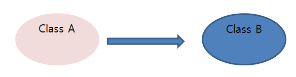

DI 스프링 IoC 기능의 대표적인 동작원리는 주로 의존관계 주입이라고 불린다. 




```java
class A {
	new B();
}
```


A는 B에 의존한다.(B가 변하면 A에 영향을 끼친다)

모델이나 코드에서 클래스와 인터페이스를 통해 드러나는 의존관계 말고, 런타임 시에 오브젝트 사이에서 만들어지는 의존관계도 있다(런타임 의존관계, 오브젝트 의존관계). 설계 시점의 의존관계가 실체화 된것이다. 

의존관계 주입은 구체적인 의존 오브젝트와 그것을 사용할 주체, 보통 클라이언트라고 부르는 오브젝트를 런타임 시에 연결해주는 작업이다.

DI란 다음 3가지 조건을 충족해야 한다. 

1. 클래스 모델이나 코드에는 런타임 시점의 의존관계가 드러나지 않는다. 그러기 위해서는 인터페이스에만 의존하고 있어야 한다. 
2. 런타임 시점의 의존관계는 컨테이너나 팩토리 (ApplicationContext)같은 제 3의 존재가 결정한다.
3. 의존관계는 사용할 오브젝트에 대한 레퍼런스를 외부에서 제공해줌으로써 만들어진다.


UserDao와 ConnectionMaker 사이에 DI가 적용되려면 UserDao도 반드시 컨테이너가 만드는 빈 오브젝트여야한다. 

+

DI를 원하는 오브젝트는 먼저 자기 자신이 컨테이너가 관리하는 빈이 되야 한다는 사실을 잊지 말자.