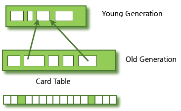

# JAVA Garbage Collection

## stop-the-world 

- GC을 실행하기 위해 JVM이 애플리케이션 실행을 멈추는 것이다.
- stop-the-world가 발생하면 GC를 실행하는 쓰레드를 제외한 나머지 쓰레드는 모두 작업을 멈춘다. 
- GC 작업을 완료한 이후에야 중단했던 작업을 다시 시작한다. 
- 어떤 GC 알고리즘을 사용하더라도 stop-the-world는 발생한다. 대개의 경우 GC 튜닝이란 이 stop-the-world 시간을 줄이는 것이다.
- GC튜닝을 잘해야 성능을 높일 수 있다는 말이다. 

## GC가 만들어 질때 고려한 전제 조건

- 대부분의 객체는 금방 접근 불가능 상태(unreachable)가 된다.

- 오래된 객체에서 젊은 객체로의 참조는 아주 적게 존재한다.

## Young, Old 영역

이 가설의 장점을 최대한 살리기 위해서 HotSpot VM에서는 크게 2개로 물리적 공간을 나누었다.

- Young 영역(Yong Generation 영역): 새롭게 생성한 객체의 대부분이 여기에 위치한다. 대부분의 객체가 금방 접근 불가능 상태가 되기 때문에 매우 많은 객체가 Young 영역에 생성되었다가 사라진다. 이 영역에서 객체가 사라질때 Minor GC가 발생한다고 말한다.
- Old 영역(Old Generation 영역): 접근 불가능 상태로 되지 않아 Young 영역에서 살아남은 객체가 여기로 복사된다. 대부분 Young 영역보다 크게 할당하며, 크기가 큰 만큼 Young 영역보다 GC는 적게 발생한다. 이 영역에서 객체가 사라질 때 Major GC(혹은 Full GC)가 발생한다고 말한다.

#####Perm영역

: 메소드영역이라고 한다. 객체나 억류된 문자열 정보를 저장하는 곳. Old영역에서 살아남은 객체가 영원히 남아있는곳은 절대 아님. 여기서 GC발생해도 Major GC의 횟수에 포함.  거의 사용되지 않는 영역으로서 클래스와 메소드 정보와 같이 자바 언어 레벨에서 사용되지 않습니다.

Old 영역에 있는 객체가 Young영역의 객체를 참조하는 경우 해결하기 위해 Old영역에 512바이트의 chunk로 되어있는 카드 테이블이 존재

Young영역의 GC를 실행할 때에는 Old영역에 있는 모든 객체의 참조를 확인하지 않고 , 이 카드 테이블만 뒤져서 GC대상인지 식별.

카드 테이블은 write barrier을 사용하여 관리. write barrier은 Minor GC를 빠르게 할 수 있도록 하는 장치. 오버헤드는 발생하지만 GC시간은 줄어들게 함.  

**4가지 GC(가비지 콜렉터) 방식**

JDK 5.0이상에서 지원하는 GC 방식에는 네가지가 있습니다. WAS나 자바 애플리케이션 수행시 옵션을 지정하여 선택할 수 있습니다.

> **Serial Collector** (이하 시리얼 콜렉터)
>
> **Parallel Collector** (이하 병렬 콜렉터)
>
> **Parallel Compacting Collector** (이하 병렬 컴팩팅 콜렉터)
>
> **Concurrent Mark-Sweep (CMS) Collector** (이하 CMS 콜렉터)

**1. 시리얼 콜렉터**

Young 영역과 Old 영역이 시리얼하게(연속적으로) 처리되며 하나의 CPU를 사용합니다. Sun에서는 이 처리를 수행할 때를 Stop-the-world라고 표현합니다. 다시 말하면, 콜렉션이 수행될 때 애플리케이션 수행이 정지됩니다.

1) 일단 살아있는 객체들은 Eden 영역에 있습니다.

2) Eden 영역이 꽉차게 되면 To Survivor 영역(비어있는 영역)으로 살아 있는 객체가 이동합니다. 이때 Survivor 영역에 들어가기에 너무 큰 객체는 바로 Old 영역으로 이동합니다. 그리고 From Survivor 영역에 있는 살아 있는 객체는 To Survivor 영역으로 이동합니다.

3) To Survivor 영역이 꽉 찼을 경우, Eden 영역이나 From Survivor 영역에 남아 있는 객체들은 Old 영역으로 이동합니다.

이 이후에 Old 영역이나 Perm 영역에 있는 객체들은 Mark-sweep-compact 콜렉션 알고리즘을 따릅니다. 이 알고리즘에 대해서 간단하게 말하면, 안 쓰는 거 표시해서 삭제하고 한 곳으로 모으는 알고리즘입니다.

> *** Mark-sweep-compact 알고리즘**
>
> 1) Old 영역으로 이동된 객체들 중 살아 있는 개체를 식별합니다. (Mark)
>
> 2) Old 영역의 객체들을 훑는 작업을 수행하여 쓰레기 객체를 식별합니다. (Sweep)
>
> 3) 필요 없는 객체들을 지우고 살아 있는 객체들을 한 곳으로 모은다 (Compact)

이렇게 작동하는 시리얼 콜렉터는 일반적으로 클라이ㅏ언트 종류의 장비에서 많이 사용됩니다. 다시 말하면, 대기 시간이 많아도 크게 문제되지 않는 시스템에서 사용된다는 의미 입니다.

시리얼 콜렉터 명시적 지정 방법

> -XX:+UseSerialGC

**2. 병렬 콜렉터**

이 방식은 throughput collector로도 알려진 방식입니다. 이 방식의 목표는 다른 CPU가 대기 상태로 남아 있는 것을 최소화하는 것입니다. 시리얼 콜렉터와 달리 Young 영역에서의 콜렉션을 병렬(Parallel)로 처리합니다. 많은 CPU 를 사용하기 때문에 GC의 부하를 줄이고 애플리케이션의 처리량을 증가시킬 수 있습니다.

Old 영역의 GC는 시리얼 콜렉터와 마찬가지로 Mark-Sweep-Compact 콜렉션 알고리즘을 사용 합니다.

병렬 콜렉터 명시적 지정 방법입니다.

> -XX:+UseParallelGC

**3. 병렬 컴팩팅 콜렉터**

병렬 콜렉터와 다른 점은 Old 영역 GC에서 새로운 알고리즘을 사용합니다. 그러므로 Young 영역에 대한 GC는 병렬 콜렉터와 동일하지만, Old 영역의 GC는 다음의 3단계를 거치게 됩니다.

1) Mark 단계 : 살아 있는 객체를 식별하여 표시해 놓는 단계

2) Sweep 단계 : 이전에 GC를 수행하여 컴팩션된 영역에 살아 있는 객체의 위치를 조사하는 단계

3) Compact 단계 : 컴팩션을 수행하는 단계. 수행 이후에는 컴팩션된 영역과 비어 있는 영역으로 나뉩니다.

병렬 콜렉터와 동일하게 이 방식도 여러 CPU를 사용하는 서버에 적합합니다. GC를 사용하는 스레드 개수는 -XX:ParallelGCThreads=n 옵션으로 조정할 수 있습니다.

병렬 컴팩팅 콜렉터 명시적 지정방법입니다.

> -XX:+UseParallelOldGC

**4. CMS 콜렉터**

이 방식은 low-latency collector로도 알려져 있으며, 힙 메모리 영역의 크기가 클 때 적합합니다. Young 영역에 대한 GC는 병렬 콜렉터와 동일합니다. Old 영역의 GC는 다음 단계를 거칩니다.

1) Mark 단계 : 매우 짧은 대기 시간으로 살아 있는 객체를 찾는 단계

2) Sweep 단계 : 서버 수행과 동시에 살아 있는 객체에 표시를 해 놓는 단계

3) Remark 단계 : Concurrent 표시 단계에서 표시하는 동안 변경된 객체에 대해서 다시 표시하는 단계

4) Concurrent Sweep 단계 : 표시되어 있는 쓰레기를 정리하는 단계

CMS는 컴팩션 단계를 거치지 않기 때문에 왼쪽으로 메모리를 몰아 놓는 작업을 수행하지 않습니다. 그래서 GC 이후에 그림과 같이 빈 공간이 발생하므로, -XX:CMSInitiatingOccupancyFraction=n 옵션을 사용하여 Old 영역의 %를 n 값에 지정합니다. (기본값 : 68)

CMS 콜렉터 방식은 2개 이상의 프로세서를 사용하는 서버에 적당합니다. 가장 적당한 대상으로는 웹서버가 있습니다.

CMS 콜렉터 명시적 지정방법입니다.

> -XX:+UseConcMarkSweepGC

CMS 콜렉터는 추가적인 옵션으로 점진적 방식을 지원합니다. 이 방식은 Young 영역의 GC를 더 잘게 쪼개어 서버의 대기 시간을 줄일 수 있습니다. CPU가 많지 않고 시스템의 대기 시간이 짧아야 할 때 사용하면 좋습니다. 점진적은 GC를 수행하려면 -XX:+CMSIncrementalMode 옵션을 지정하면 됩니다. JVM에 따라서는 -Xingc라는 옵션을 지정해도 같은 의미가 됩니다. 하지만 이 옵션을 지정할 경우 예기치 못한 성능 저하가 발생할 수 있으므로, 충분한 테스트를 한 후에 운영 서버에 적용해야 합니다.

네 종류 GC 방식에 대한 성능 및 기능 비교 표입니다.

위의 내용을 종합하면, GC 수행 시점은 다음과 같습니다. 

1) 각 영역의 할당된 크기의 메모리가 허용치를 넘을 때

2) 개발자가 컨트롤할 영역은 아님.

개발자라면, 자바의 GC 방식을 외우면서 개발하거나 서버를 세팅할 필요는 없습니다. 이해만 하고 있으면 됩니다. **단, 필요할때(시스템 오픈 전 성능 테스트 / 서버 세팅 시), 알맞은 GC 방식을 개발한 시스템에 적용**하면 된다고 합니다.

https://12bme.tistory.com/57

참조 

http://java.sun.com/javase/technologies/hotspot/gc/index.jsp

http://d2.naver.com/helloworld/1329

https://12bme.tistory.com/57